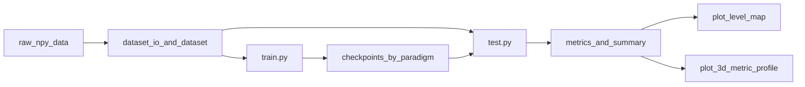

# Eddy Inversion

海洋反演项目：由海表场（SLA/SSS）重建水下多深度盐度/温盐结构，统一支持变分、统计与深度学习方法。

## 建模范式

- `2dto2d`：每个深度训练一个独立模型（当前：`eddy_unet`）。
- `2dto3d`：单模型一次输出所有深度（当前：`2dvar`、`modas`、`ocean_transformer`）。

输出目录统一为：

- `outputs/{paradigm}/{method}/...`
- `checkpoints/{paradigm}/{method}/...`

## 模型思路

### 1) eddy_unet（2dto2d）

- 思路：每层深度训练一个 2D->2D UNet，26 层对应 26 个 checkpoint。
- 训练：按深度列表循环，目标为单层 `(B,1,H,W)`。
- 推理：逐深度加载模型并拼装为 `(1,26,H,W)`，再统一评估与绘图。
- 评估口径：`test.py` 中会将标准化输出反标准化回物理量后再评估，`MAE/RMSE` 单位为 `psu`，`MSE` 为 `psu^2`。

### 2) 2dvar（2dto3d）

- 思路：变分反演，构造背景项与观测项代价函数，L-BFGS-B 迭代求解。
- 输出：`(1,D,H,W)`，默认 D=26（由 `--c-depth` 控制）。

### 3) modas（2dto3d）

- 思路：逐像素逐深度线性统计回归，在训练时段拟合系数，目标日预测整层场。
- 输出：`(1,D,H,W)`，D 由真值数据深度维决定（当前 26）。

### 4) ocean_transformer（2dto3d）

- 思路：CNN 提取海表空间特征 + 空间 Transformer + 深度 Transformer。
- 输出：`(B,D,H,W,2)`，最后一维是 `(temperature, salinity)`。
- 损失：`PhysicsLoss = MSE + 静力学平衡约束 + 层结稳定约束`。

## 项目整体架构




## 目录结构

```text
ocean-subsurface-recon/
├── config.py                     # 统一配置：范式、超参数、路径、常量
├── train.py                      # 训练入口（2dto2d/2dto3d）
├── test.py                       # 推理评估入口（2dto2d/2dto3d）
├── models/                       # 各模型/算法实现
├── datasets/                     # Dataset + 数据读入/前处理工具
│   ├── io_2dto2d.py
│   ├── io_2dto3d.py
│   ├── non_dl_preprocess.py
│   ├── date_utils.py
│   ├── eddy_dataset.py
│   └── twodto3d_dataset.py
├── utils/                        # physics / loss / metrics / viz
├── outputs/
│   ├── 2dto2d/
│   └── 2dto3d/
└── checkpoints/
    ├── 2dto2d/
    └── 2dto3d/
```

## 快速开始

### 安装

```bash
pip install -r requirements.txt
```

### 训练

```bash
# 2dto2d: eddy_unet（26层循环训练）
python train.py --method eddy_unet --data-dir ./data/raw

# 2dto3d: ocean_transformer
python train.py --method ocean_transformer --data-dir ./data/raw
```

### 推理评估

```bash
# 2dto2d: eddy_unet（逐层加载checkpoint并拼装）
python test.py --method eddy_unet --select-day 2023-06-15 --target-level 10 \
  --data-dir ./data/raw --checkpoint-dir ./checkpoints/2dto2d/eddy_unet

# 2dto3d: 2dvar
python test.py --method 2dvar --select-day 2023-06-15 --target-level 10 \
  --sla-sss-path ./data/raw/sla_sss_2019-01-01_2023-12-31_10_18_110_118.npy

# 2dto3d: modas
python test.py --method modas --select-day 2023-06-15 --target-level 10 \
  --sla-sss-path ./data/raw/sla_sss_2019-01-01_2023-12-31_10_18_110_118.npy \
  --sws-true-path ./data/raw/sws_2019-01-01_2023-12-31_10_18_110_118_0-300.npy
```

## 统一可视化产物

每个方法都保留两类输出：

1. 指定层 2D 图：`plot_level_map`
2. 3D 误差剖面图：`plot_3d_metric_profile`

统一输出文件（位于 `outputs/{paradigm}/{method}/`）：

- `pred_{method}_{date}.npy`
- `grid_metrics_{method}_{date}.npz`
- `map_*_lvl{level}_{method}_{date}.png`
- `profile_{metric}_{method}_{date}.png`
- `summary_{method}_{date}.json`

`summary` 中包含：

- `metric_units`：`mse/rmse/mae/r2` 对应单位说明

所有模型的预测产物、图和指标均使用原始物理单位。深度学习模型会在训练/推理输入侧使用训练期拟合的月气候态距平和分层标准差归一化，并在评估前反归一化；MODAS 和 2DVar 保持原始单位流程。

## 配置索引（config.py）

- 范式与方法：`PARADIGM_2DTO2D_METHODS`、`PARADIGM_2DTO3D_METHODS`
- 深度列表：`DEPTH_LEVELS_26M`
- eddy_unet 训练：`EDDY_UNET_*`
- ocean_transformer 训练：`TWODTO3D_*`
- 推理可视化：`INFER_*`
